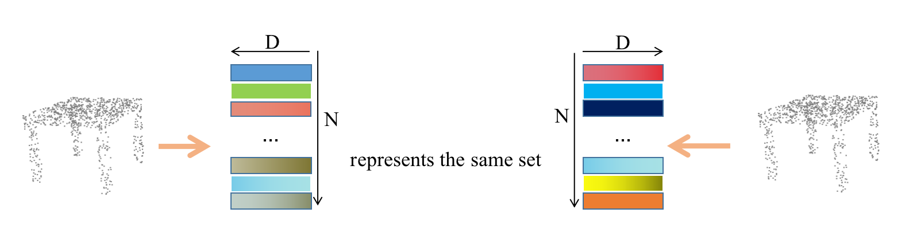
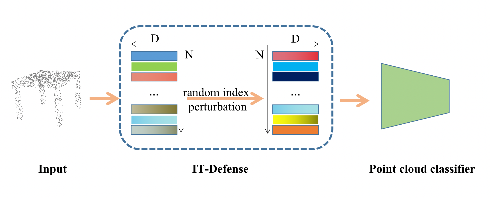

# IT-Defense
Our code for paper '[The art of defense: letting networks fool the attacker](https://arxiv.org/abs/2104.02963)'

## Introduction

Robust environment perception is critical for autonomous cars, and adversarial defenses are the most effective and widely studied ways to improve the robustness of environment perception.
However, all of previous defense methods decrease the natural accuracy, and the nature of the DNNs itself has been overlooked. To this end, in this paper, we propose a novel adversarial defense for 3D point cloud classifier that makes full use of the nature of the DNNs. Due to the disorder of point cloud, all point cloud classifiers have the property of permutation invariant to the input point cloud. Based on this nature, we design invariant transformations defense (IT-Defense).
We show that, even after accounting for obfuscated gradients, our IT-Defense is a resilient defense against state-of-the-art (SOTA) 3D attacks. Moreover, IT-Defense do not hurt clean accuracy compared to previous SOTA 3D defenses.






### Citation

if you find our work useful in your research, please consider citing:

```
@article{zhang2023art,
  title={The art of defense: letting networks fool the attacker},
  author={Zhang, Jinlai and Dong, Yinpeng and Liu, Binbin and Ouyang, Bo and Zhu, Jihong and Kuang, Minchi and Wang, Houqing and Meng, Yanmei},
  journal={IEEE Transactions on Information Forensics and Security},
  year={2023},
  publisher={IEEE}
}
```


## Usage

For example, your can insert our code in [IF-Defense baseline](https://github.com/Wuziyi616/IF-Defense/tree/main/baselines) to implement our IT-Defense.

```python
#attack_scripts/targeted_perturb_attack.py#L128 
# for input x.size() = Bx3xN
class Infer(nn.Module):
    def __init__(self, model):
        super(Infer, self).__init__()
        self.model = model
        for p in self.parameters():
            p.requires_grad = False

    def forward(self, x):
        x.data = x[:, :, torch.randperm(x.size()[2])].data
        x = self.model(x)
        return x
model = Infer(model)
```

Note that for BxNx3, our code should be `x.data = x[:, torch.randperm(x.size()[1]), :].data`

